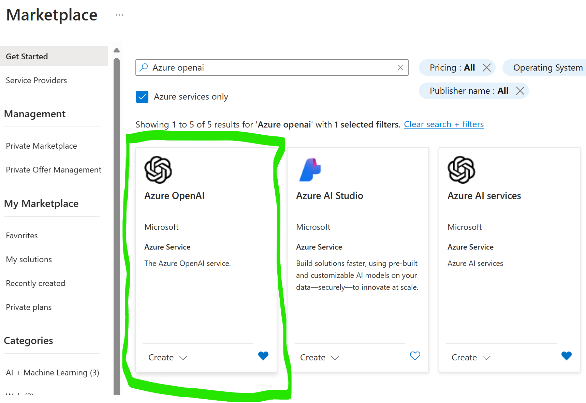
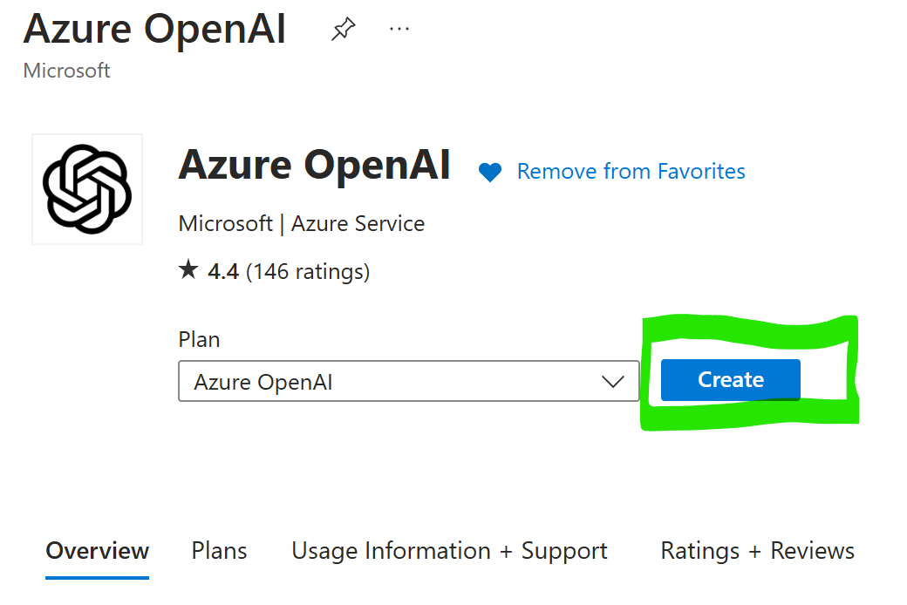
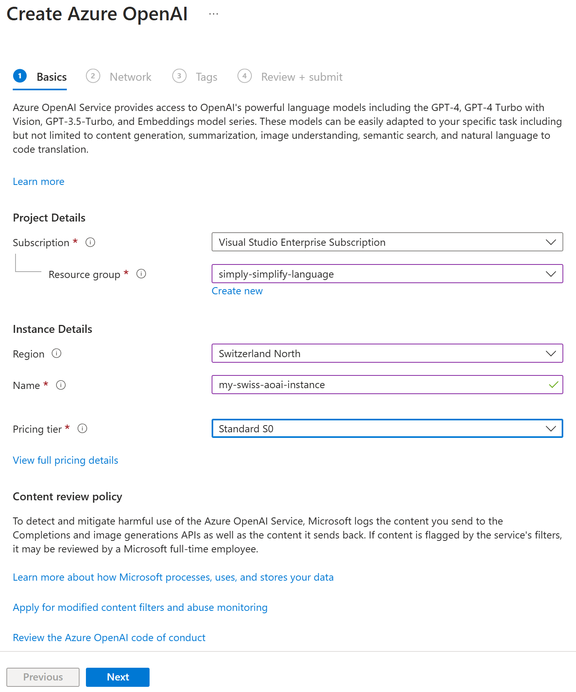
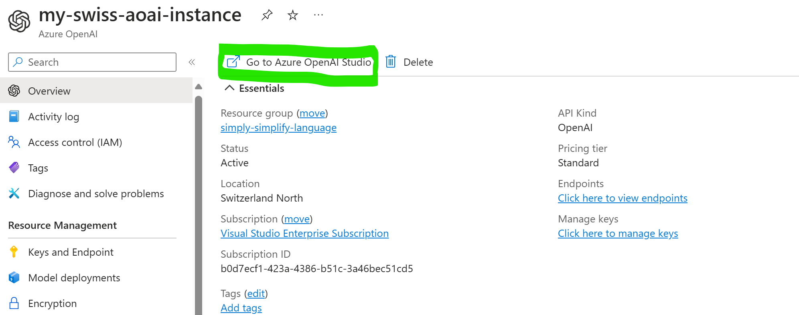
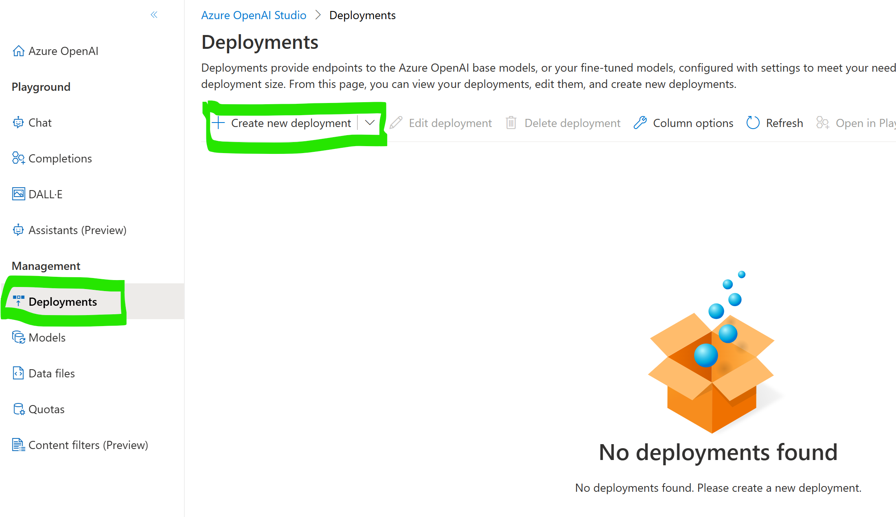
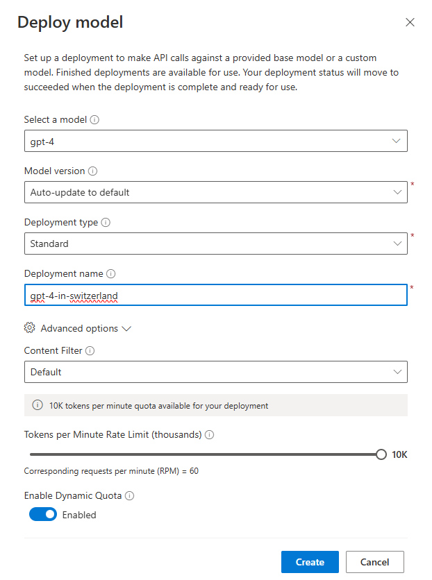
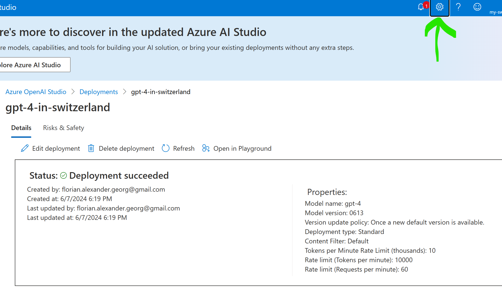
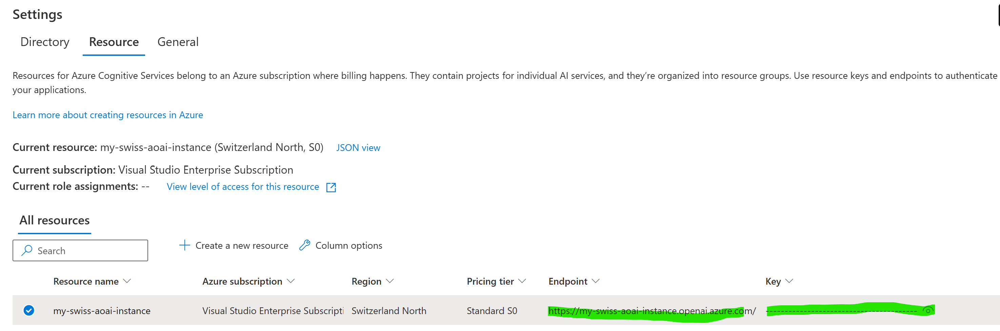

# How to setup the app with Azure OpenAI Service

In addition to (mostly US-hosted) API model endpoints, we created an app version that runs with `Azure OpenAI Services (AOAI)`. Find the docs here: <https://learn.microsoft.com/en-us/azure/ai-services/openai/>

**Benefits**

- OpenAI models can be deployed within the **Swiss Azure Cloud Region** (e.g. `switzerlandnorth`) or regions within the EU (like `westeurope`).
- This may help with achieving compliance and adress data residency considerations and governance.
- Some good reference documents:
  - [Azure Product terms](https://www.microsoft.com/licensing/terms/productoffering/MicrosoftAzure/MCA#Documents)
  - [Cloud Services in the Swiss Public Sector (Overview page)](https://news.microsoft.com/de-ch/azure-services-in-the-swiss-public-sector/)
  - [Azure Services in the Public Sector in Switzerland - DE](https://news.microsoft.com/wp-content/uploads/prod/sites/418/2021/11/Cloud-Design_Azure-Services-Swiss-Public-Sector_DE.pdf)

**Important information**
Always ensure appropriate classification and handling of your data, especially for sensitive and/or personal data.
Check with your Microsoft contact or Cloud Service Provider (Partner) representative for further questions.

**Prerequisites**

- An active **Azure account**. If you don't have one, click [here](https://azure.microsoft.com/free/cognitive-services).
- In your account, an **Azure Subscription** that has been enabled for Azure OpenAI Services.
  - Apply here: <https://aka.ms/oaiapply> (takes ~24hrs to activate)

## Walkthrough

- Go to <https://portal.azure.com>
- From the Catalog, choose `Azure OpenAI service`




- You need to select (or create) a new **Resource Group**, choose the Cloud **Region** and a unique service **Name** (becomes part of the endpoint url)
- **Note:** Not all model versions are available in all regions, see [here](https://learn.microsoft.com/en-us/azure/ai-services/openai/concepts/models). The region can't be changed afterwards (you'll need to delete & create a new service instance in that case).



- Follow the wizard to the end, and create the service.
- Once the service instance is ready, find the overview and `Go to Azure OpenAI Studio`.



- In the `Azure Open AI Studio`, go to `Deployments` and create a new model deployment.
- **Note**: If you can't create a particular model type, that model may be unavailable in your region, or your quota may be exceeded.




- Take note of the **deployment name** - this is needed later for making API calls

- Now go back and find the **Endpoint** and **API Key**. There are multiple ways to find these, but one is clicking on the gear icon on top of OpenAI Studio:




- Now add these credentials to your `_streamlit_app/.env` file:

```
AZURE_OPENAI_ENDPOINT=....
AZURE_OPENAI_API_KEY=....
AZURE_OPENAI_DEPLOYMENT=....
```

- Start the application (`cd _streamlit_app/ && python -m streamlit run ./sprache-vereinfachen_azure.py)

**Congratulations - your good to go...** 🎉

## Known limitations

- While latest OpenAI models find their way to Azure quite fast, some may be restricted to higher tiers for capacity reasons or arrive later (e.g. `GPT-4o` as of June 2024). Open a support ticket or talk to your Microsot representative if in doubt.
