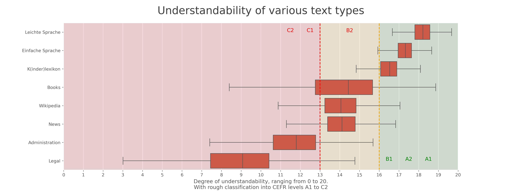

# Simply simplify language
**Use LLMs to simplify your institutional communication. Get rid of «Behördendeutsch».**

[](https://github.com/machinelearningZH/simply-simplify-language)
[](https://github.com/machinelearningZH/simply-simplify-language/stargazers)
[](https://github.com/machinelearningZH/simply-simplify-language/issues)
[](https://img.shields.io/github/issues-pr/machinelearningZH/simply-simplify-language) 
[](https://github.com/machinelearningZH/simply-simplify-language)

<details>

<summary>Contents</summary>

- [Usage](#usage)
- [Project information](#project-information)
    - [What does the app do?](#what-does-the-app-do)
    - [What does it cost?](#what-does-it-cost)
    - [Our language guidelines](#our-language-guidelines)
    - [A couple of findings](#a-couple-of-findings)
    - [Outlook](#outlook)
- [Project team](#project-team)
- [Contributing](#feedback-and-contributing)
- [Miscellaneous](#miscellaneous)

</details>


## Usage

- You can run the app **locally**, **in the cloud** or **in a [GitHub Codespace](https://github.com/features/codespaces)**. 
- If you just have an [OpenAI](https://openai.com/api/) account and do not want to use other LLMs you also can run **a variant of the app that only uses GPT-4o**. However, we recommend to give the [Mistral](https://mistral.ai/) and [Anthropic](https://www.anthropic.com/api) models a spin too. These models are very powerful too and we continuously achieve very good results.
- We also added an app version that uses the [**Azure OpenAI Service**](https://azure.microsoft.com/en-us/products/ai-services/openai-service). 


### Run the app locally
- Create a [Conda](https://conda.io/projects/conda/en/latest/index.html) environment: `conda create -n simplify python=3.9`
- Activate environment: `conda activate simplify`
- Clone this repo.
- Change into the project directory: `cd simply-simplify-language/`
- Install packages: `pip install -r requirements.txt`
- Install Spacy language model: `python -m spacy download de_core_news_sm`
- Create an `.env` file and input your API keys:
```
    OPENAI_API_KEY=sk-...
    ANTHROPIC_API_KEY=sk-...
    MISTRAL_API_KEY=KGT...
```
- Change into app directory: `cd _streamlit_app/`
- Start app: `streamlit run sprache-vereinfachen.py`

- To **run the GPT-4o only app version** use `streamlit run sprache-vereinfachen_openai.py`. 
- To **run the Azure OpenAI app version** use `streamlit run sprache-vereinfachen_azure.py`. Have a look [here to learn more about how to setup the app with Azure](AZURE_HOWTO.md).


### Run the app in the cloud
- Instantiate a small virtual machine with the cloud provider of your choosing. Suggested size: 2 vCPUs, 2GB RAM, and an SSD with a couple of GBs are sufficient. This will set you back no more than a couple of Francs per month. 
- Install Conda and set up the repo and app as described above. 
- Recommendation: To use a proper domain and HTTPS it makes sense to install a reverse proxy. We very much like [Caddy server](https://caddyserver.com/) for this due to its simplicity and ease of installation and usage. It's also simple to request certificates – Caddy does [this automatically for you](https://caddyserver.com/docs/automatic-https).

### Run the app in a Github Codespace 
- This will enable you to develop and run the app in a cloud-hosted development workspace, using [GitHub Codespaces](https://docs.github.com/en/codespaces/overview). 
- Some benefits: No need for any local installation, you can do anything right from your Web Browser. You get  some free hours with your GitHub account, so this should not be expensive at all. However, **do not forget to delete unused Codespaces to avoid being billed unnecessarily.** It's also a sensible idea, to make sure that `Auto-delete codespace` is activated in the settings.
- Create a GitHub codespace on this repository by clicking `Code > Codespaces > Create codespace on main`
- Wait until the codespace is started. You'll get a new url like `https://scaling-pancake-jwjjw54r4r7hpqpg.github.dev/`
- If you run into network connection issues try another browser. In our testing Firefox sometimes threw errors, Chrome worked fine.
- Install the project requirements from the terminal: `pip install -r requirements.txt`
- Install spacy language model: `python -m spacy download de_core_news_sm`
- Create an `.env` file and input your API keys like described above.
- Alternatively, create Repository Secrets on GitHub, which will get available for your codespaces automatically when starting up (only if you are a repo owner / using your own fork).
- Start app: `python -m streamlit run _streamlit_app/sprache-vereinfachen.py`
- Codespaces auto-proxies and forwards Port 8501 to something like `https://scaling-pancake-jwjjw54r4r7hpqpg.github.dev/`
- In case you don't like coding in your browser, you can also use a local [Visual Studio Code IDE](https://code.visualstudio.com/) and connect to the remote Codespace.

> [!Note]
> The app logs user interactions to your local computer or virtual machine to a file named `app.log`. If you do not want to have analytics, simply comment out the function call in the code. 


## Project information
**Institutional communication is often overly complicated and hard to understand.**

This particularly affects citizens who do not speak German as their first language or who struggle with complex texts for other reasons. Clear and simple communication is essential to [ensure everyone can participate in public processes and access services equally](https://www.zh.ch/de/direktion-der-justiz-und-des-innern/schwerpunkt-teilhabe.html).

For many years, the cantonal administration of Zurich has gone to great lengths to make communication more inclusive and accessible. With the increasing volume of content, we wanted to explore the potential of AI to assist in this effort. In autumn 2023, we launched a pilot project. This app is one of the results. The code in this repository represents a snapshot of our ongoing efforts.

We developed this app following our communication guidelines. However, we believe it can be easily adapted for use by other public institutions.


### What does the app do?
- This app **simplifies complex texts, rewriting them according to rules for [«Einfache Sprache»](https://de.wikipedia.org/wiki/Einfache_Sprache) or [«Leichte Sprache»](https://de.wikipedia.org/wiki/Leichte_Sprache)**. It processes your text, applies effective prompting, and uses your chosen LLM.
- The app also offers **coaching to improve your writing**. Its **analysis function** provides detailed, sentence-by-sentence feedback to enhance your communication.
- It **measures the understandability of your text** on a scale from 0 (very complex) to 20 (very easy to understand).
- The **One-Click feature sends your text to six LLMs simultaneously**, delivering six drafts in a formatted Word document within seconds, ready for download.

> [!Important]
> At the risk of stating the obvious: By using the app **you send data to a third-party provider** ([OpenAI](https://platform.openai.com/docs/overview), [Anthropic](https://www.anthropic.com/api), and [Mistral AI](https://docs.mistral.ai/) in case of the current state of the app). **Therefore strictly only use non-sensitive data.** Again, stating the obvious: **LLMs make errors.** They regularly hallucinate, make things up, and get things wrong. They often do so in subtle, non-obvious ways, that may be hard to detect. This app is **meant to be used as an assistive system**. It **only yields a draft, that you always must double- and triple-check.** 

**At the time of writing many users in our administration have extensively used the app with hundreds of texts over several months. The results are very promising.** With the prototype app, our experts have saved time, improved their output, and made public communication more inclusive.

> [!Note]
> This **app is optimized for Swiss German** («Swiss High German», not dialect). Some rules in the prompts steer the models toward this. Also the app is **setup to use the Swiss `ss` rather than the German `ß`** The understandability index assumes the Swiss `ss` for the common word scoring and we replace `ß` with `ss` in the results. 


### What does it cost?
**Usage is inexpensive**. You only pay OpenAI & Co. for the tokens that you use. E.g. for the translation of 100 separate [«Normseiten»](https://de.wikipedia.org/wiki/Normseite) (standard pages of 250 German words each) to Einfache Sprache or Leichte Sprache you pay depending on the model token cost - so roughly between 0.5 CHF for Claude Haiku and a little over 25 CHF for Claude Opus (as of June 2024). The hardware requirements to run the app are modest too. As mentioned above a small VM for a couple of Francs per month will suffice. 


### Our language guidelines
You can find the current rules that are being prompted in `utils_prompts.py`. Have a look and change these according to your needs and organizational communication guidelines.

We derived the current rules in the prompts mainly from these of our language guidelines:
- [General language guidelines zh.ch](https://www.zh.ch/de/webangebote-entwickeln-und-gestalten/inhalt/inhalte-gestalten/informationen-bereitstellen/umgang-mit-sprache.html)
- [Language guidelines Leichte Sprache](https://www.zh.ch/de/webangebote-entwickeln-und-gestalten/inhalt/barrierefreiheit/regeln-fuer-leichte-sprache.html)
- [Guidelines Strassenverkehrsamt](https://www.zh.ch/content/dam/zhweb/bilder-dokumente/themen/politik-staat/teilhabe/erfolgsbeispiele-teilhabe/Sprachleitfaden_Strassenverkehrsamt_Maerz_2022.pdf)


### A couple of findings
- **Large Language Models (LLMs) already have an understanding of Einfache Sprache, Leichte Sprache, and CEFR levels** ([A1, A2, B1, etc.](https://www.goethe.de/de/spr/kur/stu.html)) from their pretraining. It's impressive how well they can translate text by simply being asked to rewrite it according to these terms or levels. We have also successfully created test data by asking models to e.g. describe a situation at each of the six CEFR levels (A1 to C2).
- **LLMs produce varied rewrites, which is beneficial**. By offering multiple model options, users receive a range of suggestions, helping them achieve a good result. It's often effective to use the One-Click mode, which consolidates results from all models.
- **Measuring text understandability is really helpful**. Early in our project, we realized the need for a quantitative metric to evaluate our outputs, such as comparing different prompts, models, and preprocessing steps. We developed and index for this purpose that we call the «Zürcher Verständlichkeits-Index» or «ZIX» 😉. We created the ZIX using a dataset of complex legal and administrative texts, as well as many samples of Einfache and Leichte Sprache. We trained a classification model to differentiate between complex and simple texts. By selecting the most significant model coefficients, we devised a formula to estimate a text's understandability. This pragmatic metric has been useful to us in practice. We plan to publish the code for it in the coming weeks.
- Finally, **validating your results with your target audience is crucial**, especially for Leichte Sprache, which requires expert and user validation to be effective.

### How does the understandability score work?
Please note that we consider the understandability index to be a pragmatic metric. We have found it to be useful in our pilot project. It seems to work well in practice for our context and administrative texts. The score takes into account sentence lengths, the [readability metrix RIX](https://hlasse.github.io/TextDescriptives/readability.html) as well as the occurrence of common words. At the moment the score does **not** take into account other language properties that are essential for Einfache or Leichte Sprache like use of passive voice, subjunctives, complex structures in short sentences etc. Be also aware that the mapping to CEFR levels A1 to C2 should also be considered as a rough and pragmatic approach that gives an *indication* which seems to work well in practice. However, it is by no means an ‘official’ or safe measure.

As mention above the index assumes the Swiss `ss` in your texts rather than the German German `ß`. You'll get somewhat worse scores, if your text contains `ß`. The difference shouldn't be substantial. Nonetheless, we want you to be aware. 

### What does the score mean?
- Texts with **scores below 13 will be really hard to understand** (this is classic «Behördendeutsch» or legal text territory...). 
- News, Wikipedia and many books have scores between 13 to 16.
- Anything higher than 16: **You're on a good way.** 👍 Keep editing. **And validate with users!**




### Outlook
These are a couple of areas that we are actively working on:
- **Conduct more quantitative tests**: We aim to quantitatively evaluate LLM responses for completeness and accuracy. One approach we are testing is using LLMs as judges to assess these responses.
- **Enhance our understandability index**: We plan to improve word scoring by incorporating standard vocabularies for A1 to B1 levels from the Goethe Institut. Additionally, we aim to detect issues like passive voice and other problems that are currently missed.
- **Implement hard-coded guideline rules**: We want to hard-code specific rules that are difficult to prompt, such as formatting specific data or converting URLs to vanity links.
- **Establish standard vocabularies for administrative terms**: Consistent output for terms and names is crucial for our clients. We need to create a system that allows clients to manage these vocabularies themselves.
- **Experiment with open-weight models on-premise**: To process sensitive data, we are exploring lightweight models fine-tuned with German data that can be used on-premise.


## Project team
This project is a collaborative effort of these people of the cantonal administration of Zurich:

- **Simone Luchetta, Roger Zedi** - [Team Informationszugang & Dialog, Staatskanzlei](https://www.zh.ch/de/staatskanzlei/digitale-verwaltung/team.html) 
- **Emek Sahin, Peter Hotz** - [Team Kommunikation & Entwicklung, Strassenverkehrsamt](https://www.zh.ch/de/sicherheitsdirektion/strassenverkehrsamt.html)
- **Roger Meier** - [Generalsekretariat, Direktion der Justiz und des Inneren](https://www.zh.ch/de/direktion-der-justiz-und-des-innern/generalsekretariat.html#2092000119)
- **Matthias Mazenauer** - [Co-Leiter, Statistisches Amt](https://www.zh.ch/de/direktion-der-justiz-und-des-innern/statistisches-amt/amtsleitung.html)
- **Marisol Keller, Céline Colombo** - [Koordinationsstelle Teilhabe, Statistisches Amt](https://www.zh.ch/de/politik-staat/teilhabe.html)
- **Patrick Arnecke, Dominik Frefel** - [Team Data, Statistisches Amt](https://www.zh.ch/de/direktion-der-justiz-und-des-innern/statistisches-amt/data.html)

A special thanks goes to **[Government Councillor Jacqueline Fehr](https://www.zh.ch/en/direktion-der-justiz-und-des-innern/regierungsraetin-jacqueline-fehr.html)**, who came up with the idea and initiated and supported the project.


## Feedback and contributing
We are interested to hear from you. Please share your feedback and let us know how you use the app in your institution. You can [write an email](mailto:datashop@statistik.zh.ch) or share your ideas by opening an issue or a pull requests.

Please note that we use [Ruff](https://docs.astral.sh/ruff/) for linting and code formatting with default settings.

## Miscellaneous
- The wonderful people at [LIIP](https://www.liip.ch/en) refactored the understandability index into a separate API ([see this repo here](https://github.com/chregu/simply-understandability-score)). They also made it available [as a webservice](https://u15y.gpt.liip.ch/). How cool is that?! 🚀 Big shoutout to [Christian Stocker](https://www.linkedin.com/in/chregu/) for doing this!
- Also a big shout out to [Florian Georg](https://www.linkedin.com/in/fgeorg/) of Microsoft Switzerland for his great help to make the app work with [Azure AI](https://azure.microsoft.com/en-us/solutions/ai). Thanks! 