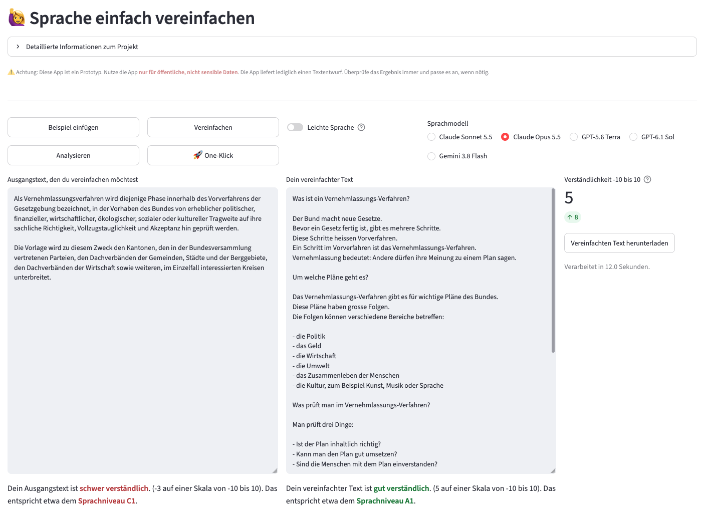
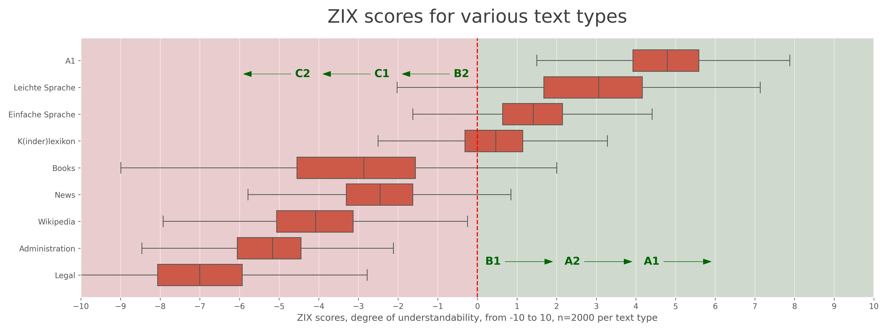

# Simply simplify language

**Use LLMs to simplify your institutional communication. Get rid of «Behördendeutsch».**


[](https://github.com/machinelearningZH/simply-simplify-language)
[](https://github.com/machinelearningZH/simply-simplify-language/stargazers)
[](https://github.com/machinelearningZH/simply-simplify-language/issues)
[](https://img.shields.io/github/issues-pr/machinelearningZH/simply-simplify-language)
[](https://github.com/machinelearningZH/simply-simplify-language)
<a href="https://github.com/astral-sh/ruff"></a>

<details>

<summary>Contents</summary>

- [Usage](#usage)
- [Project information](#project-information)
  - [What does the app do?](#what-does-the-app-do)
  - [What does it cost?](#what-does-it-cost)
  - [Our language guidelines](#our-language-guidelines)
  - [How does the understandability score work?](#how-does-the-understandability-score-work)
  - [What does the score mean?](#what-does-the-score-mean)
- [Project team](#project-team)
- [Contributing](#feedback-and-contributing)
- [License](#license)
- [Miscellaneous](#miscellaneous)
- [Disclaimer](#disclaimer)

</details>



## Usage

- You can run the app **locally**, **with Docker**, **in the cloud** or **in a [GitHub Codespace](https://github.com/features/codespaces)**.
- The app uses **[OpenRouter](https://openrouter.ai/)** as a unified API provider to access multiple leading language models.
- All available models are configured in `config.yaml` and can be easily customized for your needs.

### Running Locally

1. Install [uv](https://docs.astral.sh/uv/) and Python 3.12 or 3.13 (tested in CI). The declared requirement is `>=3.12`.
2. Clone the repo and enter the directory:\
   `cd simply-simplify-language/`
3. Install dependencies:\
   `make sync`
4. Add your OpenRouter API key to a `.env` file in `_streamlit_app/`:

```
OPENROUTER_API_KEY=sk-or-v1-...
```

5. Start the app:\
   `make run`

The Make targets are thin wrappers around `uv`; you can also run the underlying
`uv` commands directly.

#### Getting your OpenRouter API key

1. Register at [OpenRouter](https://openrouter.ai/)
2. Create an API key: [API Keys](https://openrouter.ai/keys)
3. Add credits: [Credits](https://openrouter.ai/credits)

### Running with Docker

1. Add your OpenRouter API key to `_streamlit_app/.env` as described above.
2. Build the image:

   ```bash
   docker build -t simplify .
   ```

3. Start the container and pass the API key at runtime:

   ```bash
   docker run --rm -p 8080:8501 --env-file ./_streamlit_app/.env simplify
   ```

4. Open <http://localhost:8080>.

The `.env` file is excluded from the image by `.dockerignore`. Do not add API keys to the Dockerfile or image.

### Remote deployment

Use the local or Docker setup on your remote host. Resource requirements and hosting costs have not been benchmarked in this repository. Configure HTTPS and access controls for your deployment; no reverse proxy, authentication layer, or cloud provisioning is included.

For Codespaces, install `uv` if needed, follow the local setup, and forward port 8501. There is no Codespaces configuration in this repository. You can supply `OPENROUTER_API_KEY` as an environment variable instead of `_streamlit_app/.env`. A root-level `.env` is not explicitly loaded by the app.

### Configuring Models

Edit `config.yaml` to customize available models:

- `name`: UI display name
- `id`: OpenRouter model identifier (e.g., `anthropic/claude-opus-5.5`, `openai/gpt-6.1-sol`)
- `reasoning_effort`: Optional reasoning level (`default`, `none`, `minimal`, `low`, `medium`, `high`, `xhigh`, `max`). Use levels supported by the model; `default` uses its own defaults.
- `subprovider`: Optional list of allowed OpenRouter provider or endpoint slugs, e.g. `["openai/flex", "openai"]`. A single slug is also accepted; `default` allows all available providers. The app requests price-based routing and restricts fallback to the allowed list. With a provider restriction or explicit reasoning effort, it requests providers that support the supplied parameters. Live provider availability and parameter support are not verified by repository tests.

Restart the app after editing configuration; it is cached for the running process. Model names and IDs should be unique because the app builds dictionaries from them.

For example, add `reasoning_effort: "medium"` and `subprovider: "openai"` to a model entry. These settings apply to simplification, analysis, and One-Click requests. See [provider selection](https://openrouter.ai/docs/guides/routing/provider-selection) and [reasoning levels](https://openrouter.ai/docs/guides/best-practices/reasoning-tokens).

See the model catalogue at [OpenRouter models](https://openrouter.ai/models).

Other settings in `config.yaml` include a 10,000-character UI input limit, a 120-second API timeout, two SDK retries, and an 8,192-token response limit. `api.temperature: "default"` omits the temperature parameter; a YAML float supplies an override. These values apply to every model request. The UI defaults to Einfache Sprache; enabling Leichte Sprache also exposes the condensation option, enabled by default.

> [!Note]
> Event logging is disabled by default. To enable local analytics, set `logging.enabled: true` in `config.yaml`. Events are JSON lines in `_streamlit_app/app.log` by default (`logging.filename` can override this). They contain text lengths, selected model, runtime, mode, and success status, without raw input or output. This applies to the event logger; model-call failures separately log exception traces. In One-Click mode, the event records the radio-selected model rather than all models called.

## Project information

**Institutional communication is often complicated and difficult to understand.** This can be a barrier for many people. Clear and simple communication is essential to ensure equal access to public processes and services.

The cantonal administration of Zurich has long worked to make its communication more inclusive and accessible. As the amount of content continues to grow, we saw an opportunity to use AI to support this goal. In autumn 2023, we launched a pilot project—this app is one of its results. The code in this repository is a snapshot of our ongoing work.

We developed the app according to our communication guidelines, but we know from experience that it can be easily adapted to other guidelines and by other institutions.

### What does the app do?

- This app **simplifies complex texts, rewriting them according to rules for [«Einfache Sprache»](https://de.wikipedia.org/wiki/Einfache_Sprache) or [«Leichte Sprache»](https://de.wikipedia.org/wiki/Leichte_Sprache)**. To simplify your source text, the app applies effective prompting and uses your chosen LLM via OpenRouter.
- The app also offers **coaching to improve your writing**. Its **analysis function** provides detailed, sentence-by-sentence feedback to enhance your communication.
- It **measures the understandability of your text** on a scale from -10 (very complex) to +10 (very easy to understand).
- The **One-Click feature sends your text to all configured LLMs simultaneously**, showing successful drafts with individual scores and offering a Word download containing the source and results. Failed models are listed when at least one succeeds; if all fail, the app displays an error. Runtime depends on the models and configured timeouts/retries.

In English, «Einfache Sprache» is roughly equivalent to [«Plain English»](https://www.plainlanguage.gov/about/definitions/), while «Leichte Sprache» has similarities to [«Easy English»](https://centreforinclusivedesign.org.au/wp-content/uploads/2020/04/Easy-English-vs-Plain-English_accessible.pdf).

> [!Important]
> Model requests **send your text to OpenRouter and the routed model provider**. Use **only public, non-sensitive data**. Generated text can contain factual errors or omissions. Always review the draft, ideally with people from the target audience, especially for Leichte Sprache.

> [!Note]
> This **app is configured for Swiss Standard German** («Schweizer Hochdeutsch», not dialect). Some rules in the prompts steer the models toward this. Also, the app is **set up to use the Swiss `ss` rather than the German `ß`.** The understandability index assumes the Swiss `ss` for the common word scoring, and we replace `ß` with `ss` in the results.

### What does it cost?

Model calls use your OpenRouter account. Costs depend on models, input/output tokens, reasoning, and retries; One-Click calls every configured model. The repository contains no current pricing data or cost benchmark. Check [OpenRouter pricing](https://openrouter.ai/models) before use and account separately for hosting costs.

### Our language guidelines

You can find the current rules that are being prompted in [`_streamlit_app/utils_prompts.py`](_streamlit_app/utils_prompts.py). Have a look and change these according to your needs and organizational communication guidelines.

We derived the current rules in the prompts mainly from these of our language guidelines:

- [General language guidelines zh.ch](https://www.zh.ch/de/webangebote-entwickeln-und-gestalten/inhalt/inhalte-gestalten/informationen-bereitstellen/umgang-mit-sprache.html)
- [Language guidelines Leichte Sprache](https://www.zh.ch/de/webangebote-entwickeln-und-gestalten/inhalt/barrierefreiheit/regeln-fuer-leichte-sprache.html)
- [Guidelines Strassenverkehrsamt](https://www.zh.ch/content/dam/zhweb/bilder-dokumente/themen/politik-staat/teilhabe/erfolgsbeispiele-teilhabe/Sprachleitfaden_Strassenverkehrsamt_Maerz_2022.pdf)

### How does the understandability score work?

The app delegates scoring and CEFR estimates to the external [`zix` package](https://github.com/machinelearningZH/zix_understandability-index), whose Git revision is recorded in `uv.lock`. It starts loading ZIX in a background thread after rendering the initial UI; scoring waits for that shared load when needed. The app does not train a model or read the legacy files in `_streamlit_app/data/`.

ZIX uses sentence length, RIX, common-word scores, and A1/A2/B1 vocabulary overlap. Its regression score is limited to -10 through +10. It does not explicitly evaluate all language guidelines, such as passive voice or negation. Training data and calibration evidence are not included in this repository; the score and CEFR estimate are aids for review, not proof of a language level or factual accuracy.

### What does the score mean?

The current UI classifies the unrounded score using `config.yaml`:

- Below -2: hard to understand (`schwer verständlich`).
- From -2 to below 0: moderately understandable (`nur mässig verständlich`).
- From 0: understandable (`gut verständlich`).

These score thresholds are configurable. The displayed numeric score is rounded. A single simplification shows the output score and change from the source; analysis shows the source score. One-Click shows individual output scores inline and the source score in the metric panel, rather than scoring the combined results.

The illustration below provides context for the score; it does not validate generated text.



## Project Team

Project contributors from the cantonal administration of Zurich (affiliations recorded by the project):

- **Simone Luchetta, Roger Zedi** - [Team Informationszugang & Dialog, Staatskanzlei](https://www.zh.ch/de/staatskanzlei/digitale-verwaltung/team.html)
- **Emek Sahin, Peter Hotz** - [Team Kommunikation & Entwicklung, Strassenverkehrsamt](https://www.zh.ch/de/sicherheitsdirektion/strassenverkehrsamt.html)
- **Roger Meier** - [Generalsekretariat, Direktion der Justiz und des Inneren](https://www.zh.ch/de/direktion-der-justiz-und-des-innern/generalsekretariat.html#2092000119)
- **Matthias Mazenauer** - [Co-Leiter, Amt für Statistik und Daten](https://www.zh.ch/de/direktion-der-justiz-und-des-innern/amt-fuer-statistik-und-daten/amtsleitung.html)
- **Marisol Keller, Céline Colombo** - [Koordinationsstelle Teilhabe, Amt für Statistik und Daten](https://www.zh.ch/de/politik-staat/teilhabe.html)
- **Patrick Arnecke, Chantal Amrhein, Dominik Frefel** - [Team Data, Amt für Statistik und Daten](https://www.zh.ch/de/direktion-der-justiz-und-des-innern/amt-fuer-statistik-und-daten/data.html)

Special thanks to [**Government Councillor Jacqueline Fehr**](https://www.zh.ch/en/direktion-der-justiz-und-des-innern/regierungsraetin-jacqueline-fehr.html) for initiating and supporting the project.

## Feedback and Contributing

We welcome feedback and contributions! [Email us](mailto:datashop@statistik.zh.ch) or open an issue or pull request.

We use [`ruff`](https://docs.astral.sh/ruff/) for linting and formatting. Before
submitting a change, run the complete local quality suite:

```bash
make check
```

Install repository hooks with `make install` (dependency sync plus pre-commit and pre-push hooks). `make check` checks formatting, lint, and tests without modifying files. `make pre-commit` runs configured pre-commit hooks and may change files; pre-push also runs tests and container validation. Container validation skips the build locally if Docker is unavailable; CI requires it.

CI runs pre-commit, tests on Python 3.12/3.13, a full Git-history secret scan, and a container build, health check, and vulnerability scan. The health check tests Streamlit's HTTP endpoint without an API key; it does not validate model calls or ZIX scoring.

Run `make help` for available commands. See [NOTES.md](NOTES.md) for engineering constraints.

### Repository structure

- `_streamlit_app/sprache-vereinfachen.py`: Streamlit UI, API calls, concurrent One-Click requests, session results, and in-memory Word exports.
- `_streamlit_app/app_core.py`: prompt assembly, routing parameters, result formatting, score labels, paths, background ZIX loading, and optional event logging.
- `_streamlit_app/utils_prompts.py`: shared prompts, language rules, and sample text.
- `_streamlit_app/utils_expander.md`: German project information displayed in the app.
- `config.yaml`: models, API limits, UI settings, document formatting, score thresholds, and logging.
- `tests/test_app_core.py`: deterministic core tests; no live-provider or scoring-calibration tests.
- `Dockerfile`, `scripts/validate-container.sh`, `.github/workflows/ci.yaml`: container and CI setup.

Input and the latest result are retained in Streamlit session state. Word downloads are generated in memory. The app has no database or persistent text store; optional event logs are local files.

## License

This project is licensed under the MIT License. See the [LICENSE](LICENSE) file for details.

## Miscellaneous

- Thanks to [LIIP](https://www.liip.ch/en) for refactoring the understandability index as an [API](https://github.com/chregu/simply-understandability-score) and [webservice](https://u15y.gpt.liip.ch/).
- Special shoutout to [Christian Stocker](https://www.linkedin.com/in/chregu/).
- Thanks to [Florian Georg](https://www.linkedin.com/in/fgeorg/) (Microsoft Switzerland) for help integrating with [Azure AI](https://azure.microsoft.com/en-us/solutions/ai).

## Disclaimer

This software (the Software) incorporates open-source models from [Spacy](https://spacy.io/models) and uses LLMs from various providers (Model(s)). This software has been developed according to and with the intent to be used under Swiss law. Please be aware that the EU Artificial Intelligence Act (EU AI Act) may, under certain circumstances, be applicable to your use of the Software. You are solely responsible for ensuring that your use of the Software as well as of the underlying Models complies with all applicable local, national and international laws and regulations. By using this Software, you acknowledge and agree (a) that it is your responsibility to assess which laws and regulations, in particular regarding the use of AI technologies, are applicable to your intended use and to comply therewith, and (b) that you will hold us harmless from any action, claims, liability or loss in respect of your use of the Software.
