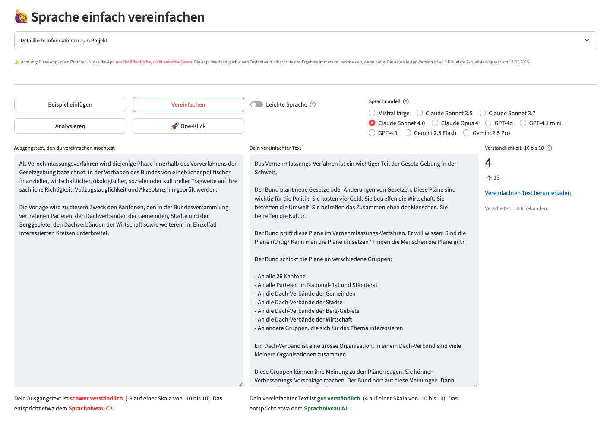

# Simply simplify language

**Use LLMs to simplify your institutional communication. Get rid of «Behördendeutsch».**


[](https://github.com/machinelearningZH/simply-simplify-language)
[](https://github.com/machinelearningZH/simply-simplify-language/stargazers)
[](https://github.com/machinelearningZH/simply-simplify-language/issues)
[](https://img.shields.io/github/issues-pr/machinelearningZH/simply-simplify-language)
[](https://github.com/machinelearningZH/simply-simplify-language)
<a href="https://github.com/astral-sh/ruff"></a>

<details>

<summary>Contents</summary>

- [Usage](#usage)
- [Project information](#project-information)
  - [What does the app do?](#what-does-the-app-do)
  - [What does it cost?](#what-does-it-cost)
  - [Our language guidelines](#our-language-guidelines)
  - [A couple of findings](#a-couple-of-findings)
  - [How does the understandability score work?](#how-does-the-understandability-score-work)
  - [What does the score mean?](#what-does-the-score-mean)
- [Project team](#project-team)
- [Contributing](#feedback-and-contributing)
- [License](#license)
- [Miscellaneous](#miscellaneous)
- [Disclaimer](#disclaimer)

</details>



## Usage

- You can run the app **locally**, **in the cloud** or **in a [GitHub Codespace](https://github.com/features/codespaces)**.
- The app uses **[OpenRouter](https://openrouter.ai/)** as a unified API provider to access multiple leading language models.
- We also provide an app version that only uses the OpenAI API.
- All available models are configured in `config.yaml` and can be easily customized for your needs.

### Running Locally

1. Install [uv](https://docs.astral.sh/uv/):\
   `pip3 install uv`
2. Clone the repo and enter the directory:\
   `cd simply-simplify-language/`
3. Create and activate a virtual environment:\
   `uv sync`\
   `source .venv/bin/activate` (Unix/macOS)\
   `.venv\Scripts\activate` (Windows)
4. Add your OpenRouter (or OpenAI) API key to a `.env` file in `_streamlit_app/`:

```
OPENROUTER_API_KEY=sk-or-v1-...
# OR for OpenAI API:
OPENAI_API_KEY=sk-...
```

5. Enter the app directory:\
   `cd _streamlit_app/`
6. Start the app:\
   `streamlit run sprache-vereinfachen.py`\
   Or for the OpenAI-only version:\
   `streamlit run sprache-vereinfachen_openai.py`

#### Getting your OpenRouter API key

1. Register at [OpenRouter](https://openrouter.ai/)
2. Create an API key: [API Keys](https://openrouter.ai/keys)
3. Add credits: [Credits](https://openrouter.ai/credits)

#### Alternatively: Getting your OpenAI API key

1. Sign up at [OpenAI](https://platform.openai.com/)
2. Add billing information and credits at [Billing](https://platform.openai.com/account/billing)
3. Create a new API key [API Keys](https://platform.openai.com/api-keys)

### Running in the Cloud

- Instantiate a small virtual machine with the cloud provider of your choosing. Suggested size: 2 vCPUs, 2GB RAM, and an SSD with a couple of GBs are sufficient. This will set you back no more than a couple of Francs per month.
- Install the app as described above for local usage.
- Recommendation: To use a proper domain and HTTPS it makes sense to install a reverse proxy. We very much like [Caddy server](https://caddyserver.com/) for this due to its simplicity and ease of installation and usage. It's also simple to request certificates – Caddy does [this automatically for you](https://caddyserver.com/docs/automatic-https).

### Running in GitHub Codespaces

You can develop and run the app in a cloud-hosted environment using GitHub Codespaces. Benefits include:

- No local installation required
- Everything runs from your web browser
- Free usage hours with your GitHub account (you still need to pay for LLM token usage)

> [!Note]
> To avoid unnecessary charges, remember to delete any unused Codespaces. It's also a good idea to enable the Auto-delete codespace option in your settings.

- Launch a codespace:\
  `Code > Codespaces > Create codespace on main`
- Install dependencies:\
  `uv sync` or `pip install -r requirements.txt`
- Install spaCy model:\
  `python -m spacy download de_core_news_sm`
- Add OpenRouter API key via `.env` or GitHub Secrets.
- Start the app:\
  `python -m streamlit run _streamlit_app/sprache-vereinfachen.py`
- Port 8501 is auto-forwarded by Codespaces.

### Configuring Models

Edit `config.yaml` to customize available models:

- `name`: UI display name
- `id`: OpenRouter model identifier (e.g., `anthropic/claude-3-5-sonnet`, `openai/gpt-4o`)

See the full model list at [OpenRouter models](https://openrouter.ai/models).

Alternatively for OpenAI:

Edit `config_openai.yaml`:

- `name`: UI display name
- `id`: OpenAI model identifier (e.g., `gpt-4o`, `gpt-4o-mini`)

See the full model list at [OpenAI models](https://platform.openai.com/docs/models).

> [!Note]
> The app logs user interactions to your local computer or virtual machine to a file named `app.log`. If you do not want to have analytics, simply comment out the function call in the code.

## Project information

**Institutional communication is often complicated and difficult to understand.** This can be a barrier for many people. Clear and simple communication is essential to ensure equal access to public processes and services.

The cantonal administration of Zurich has long worked to make its communication more inclusive and accessible. As the amount of content continues to grow, we saw an opportunity to use AI to support this goal. In autumn 2023, we launched a pilot project—this app is one of its results. The code in this repository is a snapshot of our ongoing work.

We developed the app according to our communication guidelines, but we know from experience that it can be easily adapted to other guidelines and by other institutions.

### What does the app do?

- This app **simplifies complex texts, rewriting them according to rules for [«Einfache Sprache»](https://de.wikipedia.org/wiki/Einfache_Sprache) or [«Leichte Sprache»](https://de.wikipedia.org/wiki/Leichte_Sprache)**. To simplify your source text, the app applies effective prompting, and uses your chosen LLM via OpenRouter.
- The app also offers **coaching to improve your writing**. Its **analysis function** provides detailed, sentence-by-sentence feedback to enhance your communication.
- It **measures the understandability of your text** on a scale from -10 (very complex) to +10 (very easy to understand).
- The **One-Click feature sends your text to all configured LLMs simultaneously**, delivering multiple drafts in a formatted Word document within seconds, ready for download.

In English, «Einfache Sprache» is roughly equivalent to [«Plain English»](https://www.plainlanguage.gov/about/definitions/), while «Leichte Sprache» has similarities to [«Easy English»](https://centreforinclusivedesign.org.au/wp-content/uploads/2020/04/Easy-English-vs-Plain-English_accessible.pdf).

> [!Important]
> At the risk of stating the obvious: By using the app **you send data to OpenRouter and their partner model providers** (OpenAI, Anthropic, Google, Meta, Mistral AI, etc.). **Therefore, strictly only use non-sensitive data.** Again, stating the obvious: **LLMs make errors.** They regularly hallucinate, make things up, and get things wrong. They often do so in subtle, non-obvious ways that may be hard to detect. This app is **meant to be used as an assistive system**. It **only yields a draft that you always must check.**

**At the time of writing, many users in our administration have extensively used the app with many thousands of texts over more than a year and a half. The results are very promising.** With the prototype app, our experts have saved time, improved their output, and made public communication more inclusive.

> [!Note]
> This **app is optimized for Swiss German** («Swiss High German», not dialect). Some rules in the prompts steer the models toward this. Also, the app is **set up to use the Swiss `ss` rather than the German `ß`.** The understandability index assumes the Swiss `ss` for the common word scoring, and we replace `ß` with `ss` in the results.

### What does it cost?

**Usage is inexpensive**. You only pay OpenRouter (or OpenAI) for the tokens that you use. OpenRouter provides transparent, competitive pricing for all models. E.g., for the simplification of 100 separate [«Normseiten»](https://de.wikipedia.org/wiki/Normseite) (standard pages of 250 German words each) to Einfache Sprache or Leichte Sprache, you pay depending on the model—roughly between 0.5 CHF for faster models and around 5-10 CHF for premium models like Claude Opus. Check [OpenRouter pricing](https://openrouter.ai/models) for current rates. The hardware requirements to run the app are modest too. As mentioned above, a small VM for a couple of Francs per month will suffice.

### Our language guidelines

You can find the current rules that are being prompted in `utils_prompts.py`. Have a look and change these according to your needs and organizational communication guidelines.

We derived the current rules in the prompts mainly from these of our language guidelines:

- [General language guidelines zh.ch](https://www.zh.ch/de/webangebote-entwickeln-und-gestalten/inhalt/inhalte-gestalten/informationen-bereitstellen/umgang-mit-sprache.html)
- [Language guidelines Leichte Sprache](https://www.zh.ch/de/webangebote-entwickeln-und-gestalten/inhalt/barrierefreiheit/regeln-fuer-leichte-sprache.html)
- [Guidelines Strassenverkehrsamt](https://www.zh.ch/content/dam/zhweb/bilder-dokumente/themen/politik-staat/teilhabe/erfolgsbeispiele-teilhabe/Sprachleitfaden_Strassenverkehrsamt_Maerz_2022.pdf)

### A couple of findings

- **Large Language Models (LLMs) already have an understanding of Einfache Sprache, Leichte Sprache, and CEFR levels** ([A1, A2, B1, etc.](https://www.goethe.de/de/spr/kur/stu.html)) from their pretraining. It's impressive how well they can translate text by simply being asked to rewrite it according to these terms or levels. We have also successfully created test data by asking models to e.g. describe a situation at each of the six CEFR levels (A1 to C2).
- **LLMs produce varied rewrites, which is beneficial**. By offering multiple model options through OpenRouter, users receive a range of suggestions, helping them achieve a good result. It's often effective to use the One-Click mode, which consolidates results from all configured models.
- **Measuring text understandability is really helpful**. Early in our project, we realized the need for a quantitative metric to evaluate our outputs, such as comparing different prompts, models, and preprocessing steps. We developed an index for this purpose that we call the «Zürcher Verständlichkeits-Index» or «ZIX» 😉. We created the ZIX using a dataset of complex legal and administrative texts, as well as many samples of Einfache and Leichte Sprache. We trained a classification model to differentiate between complex and simple texts. The ZIX as a metric has been very useful to us in practice. We have published the code and the Python package [here](https://github.com/machinelearningZH/zix_understandability-index).
- Finally, **validating your results with your target audience is crucial**, especially for Leichte Sprache, which requires expert and user validation to be effective.

### How does the understandability score work?

- The score takes into account sentence lengths, the [readability metric RIX](https://hlasse.github.io/TextDescriptives/readability.html), the occurrence of common words, and overlap with the standard CEFR vocabularies A1, A2, and B1.
- At the moment, the score does **not** take into account other language properties that are essential for, e.g., [Einfache Sprache](https://de.wikipedia.org/wiki/Einfache_Sprache) (B1 or easier, similar to «Plain English») or [Leichte Sprache](https://de.wikipedia.org/wiki/Leichte_Sprache) (A2, A1, similar to «Easy English»), like use of passive voice, subjunctives, negations, etc.

We have published the ZIX understandability index as a pip installable package. You can find it [here](https://github.com/machinelearningZH/zix_understandability-index).

> [!Note]
> The index is slightly adjusted to Swiss German. Specifically, we use `ss` instead of `ß` in our vocabulary lists. In practice, this should not make a big difference. For High German text that actually contains `ß`, the index will likely underestimate the understandability slightly with a difference of around 0.1.

### What does the score mean?

- **Negative scores indicate difficult texts in the range of B2 to C2**. These texts will likely be **very hard to understand for many people** (this is classic «Behördendeutsch» or legal text territory...).
- **Positive scores indicate a language level of B1 or easier**.


## Project Team

This project is a collaborative effort by these people from the cantonal administration of Zurich:

- **Simone Luchetta, Roger Zedi** - [Team Informationszugang & Dialog, Staatskanzlei](https://www.zh.ch/de/staatskanzlei/digitale-verwaltung/team.html)
- **Emek Sahin, Peter Hotz** - [Team Kommunikation & Entwicklung, Strassenverkehrsamt](https://www.zh.ch/de/sicherheitsdirektion/strassenverkehrsamt.html)
- **Roger Meier** - [Generalsekretariat, Direktion der Justiz und des Inneren](https://www.zh.ch/de/direktion-der-justiz-und-des-innern/generalsekretariat.html#2092000119)
- **Matthias Mazenauer** - [Co-Leiter, Statistisches Amt](https://www.zh.ch/de/direktion-der-justiz-und-des-innern/statistisches-amt/amtsleitung.html)
- **Marisol Keller, Céline Colombo** - [Koordinationsstelle Teilhabe, Statistisches Amt](https://www.zh.ch/de/politik-staat/teilhabe.html)
- **Patrick Arnecke, Chantal Amrhein, Dominik Frefel** - [Team Data, Statistisches Amt](https://www.zh.ch/de/direktion-der-justiz-und-des-innern/statistisches-amt/data.html)

Special thanks to [**Government Councillor Jacqueline Fehr**](https://www.zh.ch/en/direktion-der-justiz-und-des-innern/regierungsraetin-jacqueline-fehr.html) for initiating and supporting the project.

## Feedback and Contributing

We welcome feedback and contributions! [Email us](mailto:datashop@statistik.zh.ch) or open an issue or pull request.

We use [`ruff`](https://docs.astral.sh/ruff/) for linting and formatting.

## License

This project is licensed under the MIT License. See the [LICENSE](LICENSE) file for details.

## Miscellaneous

- Thanks to [LIIP](https://www.liip.ch/en) for refactoring the understandability index as an [API](https://github.com/chregu/simply-understandability-score) and [webservice](https://u15y.gpt.liip.ch/).
- Special shoutout to [Christian Stocker](https://www.linkedin.com/in/chregu/).
- Thanks to [Florian Georg](https://www.linkedin.com/in/fgeorg/) (Microsoft Switzerland) for help integrating with [Azure AI](https://azure.microsoft.com/en-us/solutions/ai).

## Disclaimer

This software (the Software) incorporates open-source models from [Spacy](https://spacy.io/models) and uses LLMs from various providers (Model(s)). This software has been developed according to and with the intent to be used under Swiss law. Please be aware that the EU Artificial Intelligence Act (EU AI Act) may, under certain circumstances, be applicable to your use of the Software. You are solely responsible for ensuring that your use of the Software as well as of the underlying Models complies with all applicable local, national and international laws and regulations. By using this Software, you acknowledge and agree (a) that it is your responsibility to assess which laws and regulations, in particular regarding the use of AI technologies, are applicable to your intended use and to comply therewith, and (b) that you will hold us harmless from any action, claims, liability or loss in respect of your use of the Software.
