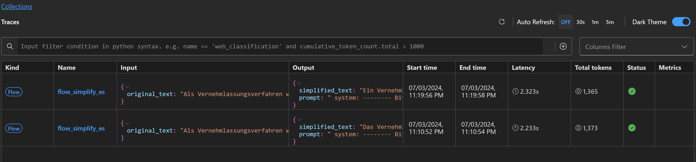
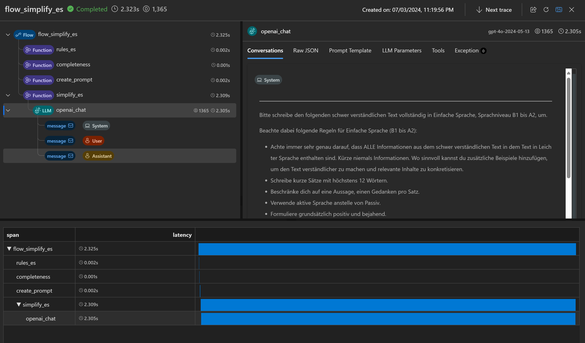

# Promptflow

Prompt flow is a suite of development tools designed to streamline the end-to-end development cycle of LLM-based AI applications.
It is **Open Source** (MIT License) and works completely standalone as a **Python library** ([pypi package](https://pypi.org/project/promptflow/)) and tools like the Visual Studio Code Extension.

**Resources**
- [Github repository](https://github.com/microsoft/promptflow)
- [Published docs](https://microsoft.github.io/promptflow/)
- [Project Homepage @ pypi.org](https://pypi.org/project/promptflow/)
- [Visual Studio Code Extension](https://marketplace.visualstudio.com/items?itemName=prompt-flow.prompt-flow)

## Getting Started

**Note**: We recommend using **GitHub Codespaces** with Devcontainers (see `./devcontainer/devcontainer.json`). 
This will setup a defined dev environment with all tools configured for you.

Alternativly, you can follow the instructions of of the [quickstart](https://microsoft.github.io/promptflow/how-to-guides/quick-start.html) to install everything manually.

The following is inspired by the [flow fine tuning tutorial](https://github.com/microsoft/promptflow/blob/main/examples%2Ftutorials%2Fflow-fine-tuning-evaluation%2Fpromptflow-quality-improvement.md?utm_source=pocket_shared)


### Current features
Main current use case is a way to automate quality testing / regression testing of your prompts against quality metrics (like the ZIX score introduced in this project). 

What you can do with it:
- Enables experimentation of different prompt variations: __"Do I get better results (like ZIX score) if I change this prompt / system message ?"__
- Enables variant testing with different parameters (temperature etc) : __"Which parameter variants provide the best scores?"__ 
- Optimize token consumption: __"Will I get (almost) the same results with a shorter system prompt, e.g. using less token?"__ 
- Enables comparison between different LLM model types: __"Does the expensive model give much better results than the cheaper one?"__
- Provides execution profiling and tracing: __"How long does model A take to process a standard text vs. model B?"__
- Supports batch proccesing and (aggregated) metrics calculation: __"What's the average score of flow variant A over my corpus of test data?"__

### Current Limitations
Currently, we only support the **OpenAI** model connections. Pull requests welcome.

### Validate local setup
Verify if promptflow is installed correctly in your local Python environment by running `pf -v`in your terminal:
```bash
> pf -v

{
  "promptflow": "1.13.0",
  "promptflow-azure": "1.13.0",
  "promptflow-core": "1.13.0",
  "promptflow-devkit": "1.13.0",
  "promptflow-tracing": "1.13.0"
}

Executable '/usr/local/bin/python'
Python (Linux) 3.9.19 (main, May 14 2024, 09:07:43) 
[GCC 10.2.1 20210110]
```

### Create Open AI Connections
Promptflow securely stores connection credentials referenced by flows. 
Before running flows for the first time, you need to create a __connection__ called _"openai_connection"_ once. (The connection data is locally stored for subsequent runs).

```bash
# Override keys with --set to avoid yaml file changes. 
# If not given, will run in interactive mode
cd promptflow
pf connection create --file ./openai_connection.yaml --set api_key=<your_api_key>


```

### Install depenedencies for evaluation flows
The eval flow needs special dependencies installed.

```bash
cd eval-simplify
# Install dependencies needed by the evaluation tools 
pip install -r requirements.txt
# Download spacy german model
python -m spacy download de_core_news_sm
```

### Run all tests
For a simplified experience you can run the `run_all_tests.sh` script. 
It will create a bunch of test runs and evaluations, ready to compare. 

For a deeper understanding on whats going on here, read on  


## Deep dive - Use Promptflow for prompt evaluation and tuning
The following sections go step by step through the process of running flows, variants, evaluations and visualization.

### Test the "Simplify" Flow
- The flow `flow-simplify-es` is used to execute simplifications based on the "Einfache Sprache" rules.
- You can select different variants (e.g. different LLM models and parameters, different system prompts, different instructions etc.).


The output is always a json with the following schema 
```json
{
  "simplified_text": "<the simplified text>",
  "prompt": "<the full, final prompt used - e.g. including system prompt and original text>"
}
```

You can run from the Visual Studio Code extension, or the `pf` CLI tool. The following shows how to do everything from the CLI.


```bash
# Assuming current working dir is ${workspace_root}/promptflow
# List existing runs
pf run list

# Test the "Simplify Einfache Sprache" flow with the default variannts and text input. 
# --ui will open the trace UI in the browser afterwards
pf flow test --flow ./flow-simplify-es --ui
```

The trace UI should look something like this:
</img>
</img>


## Create Batch "Simplify" Flow runs, with different models
Now it's time to run our flows against a test set in "batch" mode.
The default `flow.dag.yaml` currently uses `gpt-4o`, but this can be overwritten with any valid OpenAI model name.
- To set the "model", you need to overwrite the property of the flow node that calls the LLM using the  `--connections` parameter. The node name is `simplify_es`, so use e.g. `'--connections simplify_es.model=gpt-4o'`

```bash
# Assume working directory is /promptflow

# Create a batch run against data.jsonl using gpt-4o
pf run create \
  --name base_run_4o \
  --flow ./flow-simplify-es \ 
  --data ./test_data.jsonl \
  --connections simplify_es.model=gpt-4o

# Create a batch run against data.jsonl using gpt-3.5-turbo
pf run create \
  --name base_run_35turbo \
  --flow ./flow-simplify-es \
  --data ./test_data.jsonl \
  --connections simplify_es.model=gpt-3.5-turbo

# List the runs
pf run list

# Shows the run information
pf run show --name base_run_4o
pf run show --name base_run_35turbo

# Shows the run input and output
pf run show-details --name base_run_4o
pf run show-details --name base_run_35turbo

```

__Note__: Run names need to be unique, so if you run these again, choose a different name or delete the runs first, like this: `pf run delete -y --name base_run_4o`  

## Create batch runs for different variants
You can also create runs and select different "variants" of a flow. The way you select them is via the `--variant '${<node_name>.<variant-name>}` parameter. See `flow.dag.yaml`for available variants, and add your own if you want.

- Right now, we support multiple different Prompt templates as variants, like this:
- Rules
  - `${rules_es.full_instructions}` (default): Uses full length instructions prompt
  - `${rules_es.short_instructions}`:  Uses a shorter prompt for instructions (e.g. to save tokens)
- Completeness
  - `${completeness.full}` (default): Try to include ALL information and examples
  - `${completeness.condensed}`: Include key information (only), with examples

```bash
#  Create a GPT-4o run with alternative, shortened instructions and condensed output
# To delete an existing previous run: pf run delete -y --name base_run_4o_short_instructions_condensed
pf run create \
  --name base_run_4o_short_instructions_condensed \
  --flow ./flow-simplify-es \
  --data ./test_data.jsonl \
  --connections simplify_es.model=gpt-4o \
  --variant '${rules_es.short_instructions}' \
  --variant '${completeness.condensed}'


#  Create a GPT-3.5-Turbo run with alternative, shortened instructions and condensed output
pf run create \
  --name base_run_35turbo_short_instructions_condensed \
  --flow ./flow-simplify-es \
  --data ./test_data.jsonl \
  --connections simplify_es.model=gpt-3.5-turbo \
  --variant '${rules_es.short_instructions}' \
  --variant '${completeness.condensed}'


```
 
See [here](https://microsoft.github.io/promptflow/reference/pf-command-reference.html#pf-run-create) for more detais on creating runs via the pf tool.

## Evaluate the quality of your flows
The Evaluation flow is a special kind of flow that takes the previous output of a flow run (and potentially ground truth data) and calculates aggregated metrics.
In our case, it will calculate the following metrics per runned line
- The __ZIX score__ of both the original and the simplified texts
- The estimated __language_levels__ of both the original and simplified texts 
- The __estimated cost__, by taking the model and prompts into account. 
We count the tokens of the `prompt` as input tokens, and `simplified_text`as output tokens (as these two categories have different pricing)
- See the `estimate_cost.py` for token costs for different models, and adjust accordingly.
- An __value for money__ score which calculates an opinionated metric on how good the simplification is, relative to the estimated cost of the model. The formula is `(zix_original - zix_simplified) / estimated_cost`.

These metrics will be calculated "per line", as well as aggregated averages over the full batch of input data.
The result of the eval flow looks like this:
```json
{

}
```


### Run eval flow (CLI)
We currently have no "ground throuth" to use in eval flows, as there are no "hand crafted" simplified texts for our test dataset. We simply reference the ouput values of previous flow runs to calculate our score metrics like the ZIX score, which should be a good approximation of quality.

In future releases we could e.g. reference manually simplified texts by experts, and calculate BLEU or ROUGE scores against them.

In order to perform an eval flow, we need to do a `--column-mapping` to map the following properties from the previouis flow run to the eval flow inputs:
- run.inputs.original_text -> original_text (the original input text to simplify)
- run.outputs.simplified_text -> simplified_text (the simplified text from the flow run)
- run.outputs.prompt -> prompt (the full prompt that was used for simplification)
- '<model name>' -> model (e.g. 'gpt-4o' or 'gpt-3.5-turbo' of the flow run)

```bash
# Assume working dir is /promptflow

# Create an eval flow run against "base_run_4o"
pf run create \
  --name eval_base_run_4o \
  --flow ./eval-simplify \
  --run base_run_4o \
  --column-mapping model='gpt-4o' original_text='${run.inputs.original_text}' simplified_text='${run.outputs.simplified_text}' prompt='${run.outputs.prompt}'

# ... similar for the other runs

```

After the eval flow is done, you can get the results via:
```bash
# Shows the inputs/outputs of the eval flow
pf run show-details --name eval_base_run_4o

# Shows the calculated scores and metrics
pf run show-metrics --name eval_base_run_4o

```

### Run eval flow (VS Code Extension)
The VS Code extension proveds a nice integrated way to run (eval) flows.

- Open the visal flow editor of the eval flow
- Select "Run batch" and select the flow run as input
- define the mappings


### Visualize results
Now we have a few variants of batch tests, where we can compare the results against each other,
e.g. using a browser web view:

```bash
$base_run_name=base_run_4o
$eval_run_name=eval_base_run_40
pf run visualize --name "$base_run_name,$eval_run_name"

```

You can also use the Visual Studio Code extension:
image 


### Next steps
Refer to the Tutorial for an example and the Promptflow docs. 
But essentially, you can now iterate with prompt tuning the variants and templates, and compare the metrics and scores against. 
__Note__: You'll need to give the flow runs unique names, e.g. using timestamps on each run. This way, you can track the performance over time.

For automation and regression testing, using the Promptflow SDK inside of automated test cases would be probably be better than using the pf CLI tool.

See here for more information.


### Cleanup
The above examples (and the `run_all_tests.sh` script) use hardcoded names for all runs, as otherwise it's easy to pollute your workspace with lots of runs (e.g. when using the VS Code Extension, which creates new runs every time).
This means you can only do this once, unless you change the run names, as each run needs to have a unique name.

Use the following script to delete all runs (incl. eval runs) from above, to start over.
We're working on a more robust approach for the future.

```bash
# Delete all flows and variants
pf run delete -y --name base_run_4o
pf run delete -y --name base_run_35turbo
pf run delete -y --name base_run_4o_short_instructions_condensed
pf run delete -y --name base_run_35turbo_short_instructions_condensed

# Delete all corresponding eval flows
pf run delete -y --name eval_base_run_4o
pf run delete -y --name eval_base_run_35turbo
pf run delete -y --name eval_base_run_4o_short_instructions_condensed
pf run delete -y --name eval_base_run_35turbo_short_instructions_condensed

# Make sure we cleaned up everything
pf run list
```